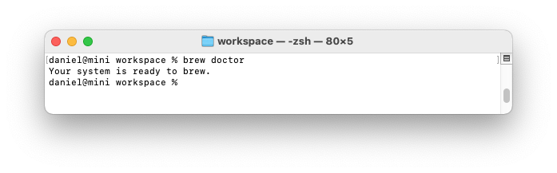

# Installing Python

Python has several different versions and a number of ways it can be set
up on each operating system. This appendix is useful if the approach in
[Chapter 1](ch01.html#ch01) didn’t work, or if you want to install a
different version of Python than the one that came with your system.

## Operating Systems

### **Python on Linux**

Python is included by default on almost every Linux system, but you
might want to use a different version than the default. If so, first
find out which version of Python you already have installed.

#### ***Finding the Installed Version in Linux***

Open a terminal window and issue the following command:

\$ python --version  
Python 2.7.6

The result shows that the default version is 2.7.6. However, you might
also have a version of Python 3 installed. To check, enter the following
command:

\$ python3 --version  
Python 3.5.0

Python 3.5.0 is also installed. It’s worth running both commands before
you attempt to install a new version.

#### ***Installing Python 3 on Linux***

If you don’t have Python 3, or if you want to install a newer version of
Python 3, you can install it in just a few lines. We’ll use a package
called deadsnakes, which makes it easy to install multiple versions of
Python:

\$ sudo add-apt-repository ppa:fkrull/deadsnakes  
\$ sudo apt-get update  
\$ sudo apt-get install python3.5

These commands will install Python 3.5 to your system. The following
code will start a terminal session running Python 3.5:

\$ python3.5  
\>\>\>

You’ll also want to use this command when you configure your text editor
to use Python 3 and when you run programs from the terminal.

### **Python on macOS**

Python is already installed on most macOS systems, but you might want to
use a different version than the default. If so, first find out which
version of Python you already have installed.

#### ***Finding the Installed Version in macOS***

Open a terminal window, and enter the following command:

\$ python --version  
Python 2.7.6

You should also try running the command **python3 --version**. You’ll
probably get an error message, but it’s worth checking to see if the
version you want is already installed.

#### ***Using Homebrew to Install Python 3***

If you only have Python 2 installed, or if you have an older version of
Python 3, you can install the latest version of Python 3 using a package
called Homebrew.

##### **Installing Homebrew**

Homebrew depends on Apple’s Xcode package, so open a terminal and run
this command:

\$ xcode-select --install

Click through the confirmation dialogs that pop up (this may take a
while, depending on the speed of your connection). Next, install
Homebrew:

\$ ruby -e "\$(curl -fsSL
https://raw.githubusercontent.com/Homebrew/install/  
master/install)"

You can find this command on the front page of the Homebrew site at
*<http://brew.sh/>*. Make sure you include a space between curl -fsSL
and the URL.

| **NOTE**                                                                                                                                                                                                                                                                                                                                                                             |
|--------------------------------------------------------------------------------------------------------------------------------------------------------------------------------------------------------------------------------------------------------------------------------------------------------------------------------------------------------------------------------------|
| *The* -e *in this command tells Ruby (the programming language Homebrew is written in) to execute the code that’s downloaded here. You should only run commands like this from sources you trust.* To confirm that Homebrew installed correctly, run this command:`$` `brew doctor` `Your system is ready to brew.`   This output means you’re ready to install Python packages through Homebrew. |

##### **Installing Python 3**

To install the latest version of Python 3, enter the following command:

\$ brew install python3

Let’s check which version was installed using this command:

\$ python3 --version  
Python 3.5.0  
\$

Now you can start a Python 3 terminal session using the command python3,
and you can use the python3 command to configure your text editor so it
runs Python programs with Python 3 instead of Python 2.

### **Python on Windows**

Python isn’t usually included by default on Windows, but it’s worth
checking to see if it exists on the system. Open a terminal window by
right-clicking on your desktop while holding the SHIFT key, and then
select **Open Command Window Here**. You can also enter command into the
Start Menu. In the terminal window that pops up, run the following
command:

\> python --version  
Python 3.5.0

If you see output like this, Python is already installed, but you still
might want to install a newer version. If you see an error message,
you’ll need to download and install Python.

#### ***Installing Python 3 on Windows***

Go to *<http://python.org/downloads/>* and click the version of Python
you want. Download the installer, and when you run it make sure to check
the *Add Python to PATH* option. This will let you use the python
command instead of having to enter your system’s full path to python,
and you won’t have to modify your system’s environment variables
manually. After you’ve installed Python, issue the python --version
command in a new terminal window. If it works, you’re done.

#### ***Finding the Python Interpreter***

If the simple command python doesn’t work, you’ll need to tell Windows
where to find the Python interpreter. To find it, open your C drive and
find the folder with a name starting with *Python* (you might need to
enter the word python in the Windows Explorer search bar to find the
right folder). Open the folder, and look for a file with the lowercase
name *python*. Right-click this file and choose **Properties**; you’ll
see the path to this file under the heading *Location*.

In the terminal window, use the path to confirm the version you just
installed:

\$ C:\\\\Python35\\python --version  
Python 3.5.0

#### ***Adding Python to Your Path Variable***

It’s annoying to type the full path each time you want to start a Python
terminal, so we’ll add the path to the system so you can just use the
command python. If you already checked the *Add Python to PATH* box when
installing, you can skip this step. Open your system’s **Control
Panel**, choose **System and Security**, and then choose **System**.
Click **Advanced System Settings**. In the window that pops up, click
**Environment Variables**.

In the box labeled *System variables*, look for a variable called Path.
Click **Edit**. In the box that pops up, click in the box labeled
*Variable value* and use the right arrow key to scroll all the way to
the right. Be careful not to overwrite the existing variable; if you do,
click Cancel and try again. Add a semicolon and the path to your
*python.exe* file to the existing variable:

%SystemRoot%\\system32\\...\\System32\\WindowsPowerShell\\v1.0\\;C:\\Python34

Close your terminal window and open a new one. This will load the new
Path variable into your terminal session. Now when you enter python
--version, you should see the version of Python you just set in your
Path variable. You can now start a Python terminal session by just
entering python at a command prompt.

### **Python Keywords and Built-in Functions**

Python comes with its own set of keywords and built-in functions. It’s
important to be aware of these when you’re naming variables. One
challenge in programming is coming up with good variable names, which
can be anything that’s reasonably short and descriptive. But you can’t
use any of Python’s keywords, and you shouldn’t use the name of any of
Python’s built-in functions because you’ll overwrite the functions.

In this section we’ll list Python’s keywords and built-in function
names, so you’ll know which names to avoid.

#### ***Python Keywords***

Each of the following keywords has a specific meaning, and you’ll see an
error if you try to use them as a variable name.

False    class      finally    is         return  
None     continue   for        lambda     try  
True     def        from       nonlocal   while  
and      del        global     not        with  
as       elif       if         or         yield  
assert   else       import     pass  
break    except     in         raise

#### ***Python Built-in Functions***

You won’t get an error if you use one of the following readily available
built-in functions as a variable name, but you’ll override the behavior
of that function:

abs()          divmod()      input()         open()      staticmethod()  
all()          enumerate()   int()           ord()       str()  
any()          eval()        isinstance()    pow()       sum()  
basestring()   execfile()    issubclass()    print()     super()  
bin()          file()        iter()          property()  tuple()  
bool()         filter()      len()           range()     type()  
bytearray()    float()       list()          raw_input() unichr()  
callable()     format()      locals()        reduce()    unicode()  
chr()          frozenset()   long()          reload()    vars()  
classmethod()  getattr()     map()           repr()      xrange()  
cmp()          globals()     max()           reversed()  zip()  
compile()      hasattr()     memoryview()    round()     \_\_import\_\_()  
complex()      hash()        min()           set()       apply()  
delattr()      help()        next()          setattr()   buffer()  
dict()         hex()         object()        slice()     coerce()  
dir()          id()          oct()           sorted()    intern()

**NOTE**

*In Python 2.7* print *is a keyword, not a function. Also,* unicode()
*is not available in Python 3. Neither of these words should be used as
a variable name.*
