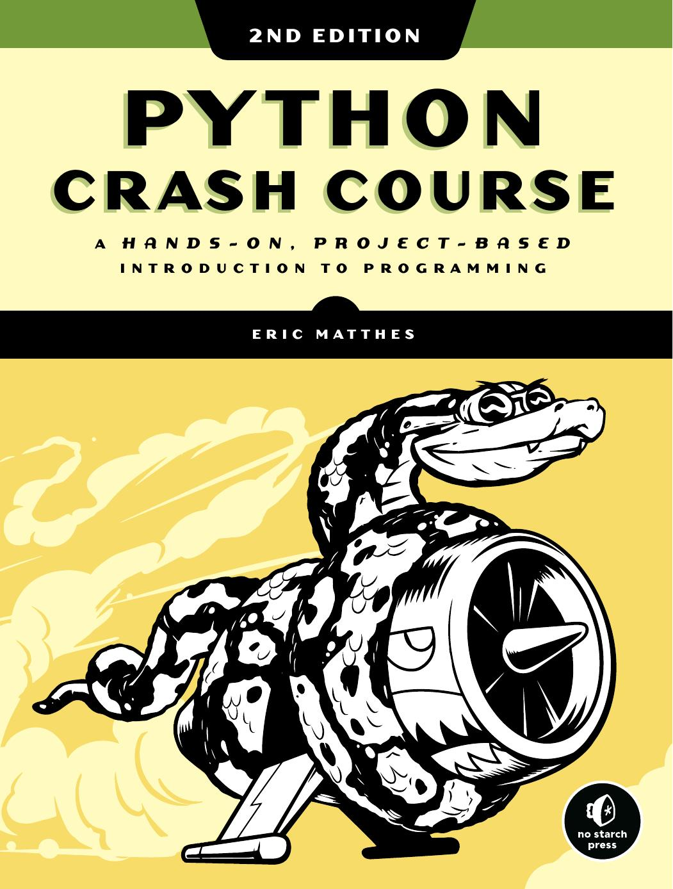

# Python Crash Course

## A Hands-On, Project-Based Introduction to Programming

)

This is a tutoring curriculum for learning Python using [Python Crash Course, 2nd Edition](https://www.amazon.ca/Python-Crash-Course-Eric-Matthes/dp/1593279280?&linkCode=ll1&tag=mavaddat-20&linkId=9a5ce7ddbcd95a4320240caaa6247aee&language=en_CA&ref_=as_li_ss_tl), an introductory programming book from [No Starch Press](http://www.nostarch.com/pythoncrashcourse/) by [Eric Matthes](https://github.com/ehmatthes).

### Contact

If you have any questions about Python Crash Course, please  [join the Discord server](https://discord.gg/KzzTBbr), contact [Mavaddat](https://www.mavaddat.ca), or get in touch with the book's author:

[📧 `ehmatthes@gmail.com`](mailto:ehmatthes@gmail.com)

[  @ehmatthes](http://twitter.com/ehmatthes/)

### Get Started

If you are a student following this curriculum for the first time, please jump to the [setup instructions below](#setup-instructions) below.

### Homework

Exercises ✍🏽
---
The book has several sections that reinforce learning through exercises. Practice what you just read where you see:

- Getting Started \([Chapter 1](/chapter_01/tiy-ch01.md)\)

- Variables And Simple Data Types \([Chapter 2](/chapter_02/tiy-ch02.md)\)

- Introducing Lists \([Chapter 3](/chapter_03/tiy-ch03.md)\)

- Working With Lists \([Chapter 4](/chapter_04/tiy-ch04.md)\)

- If Statements \([Chapter 5](/chapter_05/tiy-ch05.md)\)

- Dictionaries \([Chapter 6](/chapter_06/tiy-ch06.md)\)

- User Input And While Loops \([Chapter 7](/chapter_07/tiy-ch07.md)\)

- Functions \([Chapter 8](/chapter_08/tiy-ch08.md)\)

- Classes \([Chapter 9](/chapter_09/tiy-ch09.md)\)

- Files And Exceptions \([Chapter 10](/chapter_10/tiy-ch10.md)\)

- Testing Your Code \([Chapter 11](/chapter_11/tiy-ch11.md)\)

- A Ship That Fires Bullets \([Chapter 12](/chapter_12/tiy-ch12.md)\)

- Aliens! \([Chapter 13](/chapter_13/tiy-ch13.md)\)

- Scoring \([Chapter 14](/chapter_14/tiy-ch14.md)\)

- Generating Data \([Chapter 15](/chapter_15/tiy-ch15.md)\)

- Downloading Data \([Chapter 16](/chapter_16/tiy-ch16.md)\)

- Working With API's \([Chapter 17](/chapter_17/tiy-ch17.md)\)

- Getting Started With Django \([Chapter 18](/chapter_18/tiy-ch18.md)\)

- User Accounts \([Chapter 19](/chapter_19/tiy-ch19.md)\)

- Styling And Deploying An App \([Chapter 20](/chapter_20/tiy-ch20.md)\)

### Setup Instructions

Here you can find instructions for:

- [Installing Python](/appendix_a/appendix_a.md)&#09;(Appendix A)
- [Installing and configuring Python](/chapter_01/tiy-ch01.md)&#09;(Chapter 1)
- [Installing and using pip](/chapter_12/installing_pip.md)&#09;(Chapter 12)
- [Installing Pygame](/chapter_12/tiy-ch12.md)&#09;(Chapter 12)
- [Installing matplotlib and Pygal](/chapter_15/tiy-ch15.md) &#09;(Chapter 15)
- [Creating a Virtual Environment](/chapter_18/tiy-ch18.md)&#09;(Chapter 18)
- [Deploying a Project to Heroku](/chapter_20/tiy-ch20.md)&#09;(Chapter 20)

Downloading source code
---
The most direct way to get the online resources for the book is to click on the [*Download ZIP*](https://github.com/mavaddat-javid-education/pcc_2e/archive/master.zip) button on the upper right side of [this page](https://github.com/mavaddat-javid-education/pcc_2e), which will download the source code files (and other resources) for the entire book.

[Cheat Sheets](/cheat_sheets/cheat_sheets.md)
---

Cheat sheets can be really helpful when you're working on a set of programming exercises or a project. This set of [cheat sheets](/cheat_sheets/cheat_sheets.md) will help remind you of the concepts you're learning, as well as the Python syntax for these concepts.

[Updates](/updates/updates.md)
---

Some of the [PyPI](https://en.wikipedia.org/wiki/Python_Package_Index) libraries featured in the book have been updated recently, which is a good thing &mdash; it means that the Python packages you're learning to use are being steadily improved.

When packages are updated you have the option of using the version that was featured in the book, which lets you run code exactly as it's written in the book. You can also choose to install the latest version of each package, and modify the code in the book slightly. Each approach is outlined clearly in these updates.

A list of updates is kept [here](/updates/updates.md).
